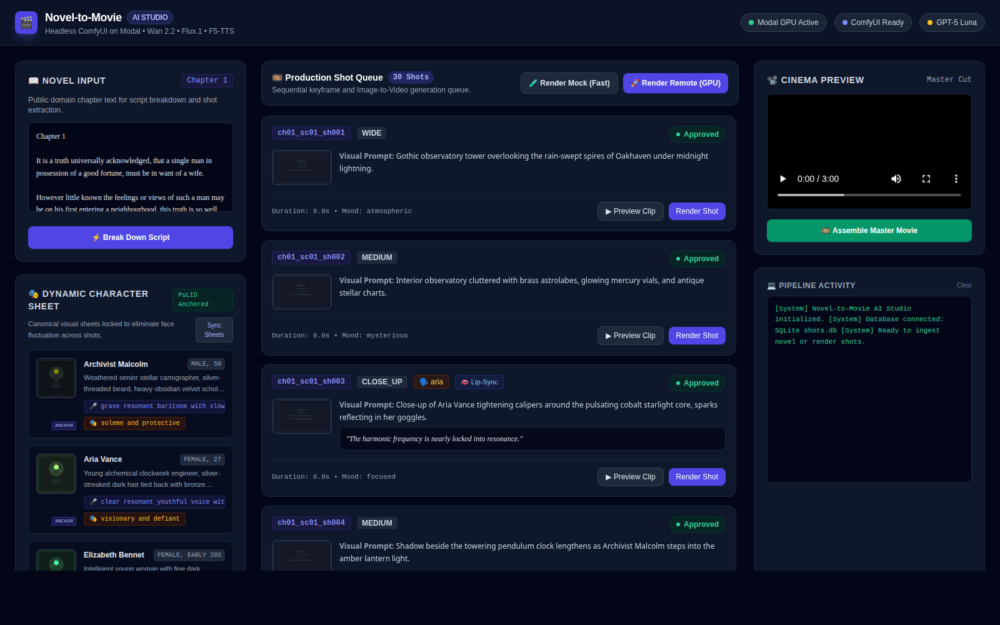

# Novel-to-Movie AI Pipeline

Autonomous end-to-end pipeline that transforms public-domain literature into an hour-long cinematic drama with consistent cast, character voices, and cinematography.



## Core Stack
- **Web Studio**: Modern interactive dashboard powered by FastAPI with live character sheet portraits and keyframe previews.
- **Language & Paradigm**: Python 3.11+ strictly following **Functional Programming** (pure functions, immutable Pydantic models).
- **Package Manager**: Managed with [`uv`](https://docs.astral.sh/uv/).
- **Creative Reasoning**: Frontier LLMs (**GPT-5 Luna** via OpenRouter) for dynamic cast discovery from ANY literature text, scene breakdown, shot extraction, and multimodal QA.
- **Zero Facial Fluctuation Engine**:
  - Dynamically synthesizes high-fidelity **canonical visual character turnaround sheets** (`output/characters/{char_id}_sheet.png`).
  - Anchors every subsequent shot keyframe directly onto the character sheet image via **PuLID-Flux / IP-Adapter**, guaranteeing face consistency across all shots.
- **Rendering & Synthesis**: Open-source models running in headless **ComfyUI on Modal**:
  - **Flux.1-Dev + PuLID-Flux**: Identity-locked facial keyframes (A10G).
  - **Wan 2.2 14B / LTX-Video**: High-coherence Image-to-Video generation (H100/A100).
  - **F5-TTS**: Zero-shot voice cloning from 10s audio reference samples (L4).
  - **LatentSync**: Diffusion-based neural lip-sync for speaking close-ups (A10G).
  - **FFmpeg**: Lossless timeline concatenation and audio mixing.

---

## How to Generate a Video Right Now

### Option A: Via the Web Studio (Recommended)

1. **Launch the Web Studio**:
   ```bash
   uv run python app.py
   ```
2. **Open the Dashboard**:
   Navigate to [http://localhost:8000](http://localhost:8000) in your web browser.
3. **Generate Video in 3 Clicks**:
   * **Click "⚡ Break Down Script"**: Uses frontier LLM to parse the novel chapter into structured shot jobs.
   * **Click "🚀 Render Remote (GPU)"** (or **"🧪 Render Mock"** for an instant local preview): Renders the keyframe, animates the video, applies neural lip-sync, and passes through the quality gate.
   * **Click "🎞️ Assemble Master Movie"**: Stitches approved clips into the master film and streams it immediately in the **Cinema Preview**!

---

### Option B: Via the Command Line (CLI)

```bash
# 1. Initialize SQLite Database
uv run python scripts/run_pipeline.py init-db

# 2. Break down novel chapter into shot jobs
export OPENROUTER_API_KEY="your-api-key"
uv run python scripts/run_pipeline.py breakdown data/sample_chapter.txt --chapter-num 1

# 3. Check queue status
uv run python scripts/run_pipeline.py status

# 4. Render shots (use --no-mock for remote Modal GPU, or --mock for instant local preview)
uv run python scripts/run_pipeline.py render-all --mock

# 5. Assemble final film
uv run python scripts/run_pipeline.py assemble --output-filename final_scene.mp4
```

---

## Deploying to Modal

To run rendering on your remote cloud GPUs:

```bash
# 1. Download model weights onto your persistent Modal Volume
uv run python scripts/run_pipeline.py download-models

# 2. Deploy headless ComfyUI and F5-TTS workers
uv run python scripts/run_pipeline.py deploy-modal

# 3. (Optional) Launch interactive ComfyUI session in browser
uv run python scripts/run_pipeline.py comfy-ui
```

---

## Running Automated Tests

```bash
uv run pytest
```

For full architectural contracts and operational rules, see [PROJECT_MEMORY.md](PROJECT_MEMORY.md).
